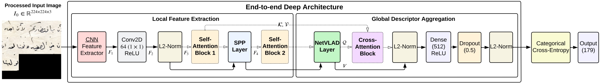

# Different Strokes for Different Folks: Writer Identification for Historical Arabic Manuscripts

_Hamza A. Abushahla, Ariel Justine Navarro Panopio, Layth Al-Khairulla, and Dr. Mohamed I. AlHajri_

This repository contains the full implementation and supplementary materials for our paper, **Different Strokes for Different Folks: Writer Identification for Historical Arabic Manuscripts**. It includes all code, configurations, and documentation needed to reproduce the experiments and extend the methodology — as well as full access to our manually curated dataset and labeling effort.

<div align="center">
  
</div>
<p align="center"><em>Figure 1: Proposed end-to-end architecture illustrating both the attention-based and no-attention variants. The dashed
blocks and arrows represent the optional attention path, which is active only in the attention-based version.</em></p>


## 📌 Overview

This work presents the **first** application of the **[Muharaf dataset](https://github.com/MehreenMehreen/muharaf)** for **writer identification** on historical Arabic manuscripts. Our contributions can be summarized as follows:

- We manually verified and labeled a substantial chunk of the public portion of the Muharaf dataset, significantly expanding the amount of labeled data from 6,858 lines (28.00\%) to 21,249 lines (86.75\%), thereby enhancing its applicability for supervised learning and writer identification.
- We developed an end-to-end CNN-based DL system with attention mechanisms for line-level writer identification in historical Arabic handwritten manuscripts, accommodating up to two authors per line.
- We demonstrate that fine-tuning pre-trained feature extractors achieves performance that matches or surpasses that of non-fine-tuned models while significantly reducing training time.
- We provide an in-depth analysis of the optimal number of layers to unfreeze during fine-tuning, showing that when executed correctly, fine-tuning far surpasses training from scratch---thereby highlighting the benefits of transfer learning.
- We highlight the challenges and potential of leveraging partially annotated datasets, such as Muharaf, for writer identification, offering valuable insights for future research in writer identification and related domains.
  
---


## 📂 1. Dataset and Manual Labeling Effort

We provide our cleaned and labeled dataset through Google Drive:

- 📦 **Lines folder**: [Download here](https://drive.google.com/file/d/1nyuI01sw17BObYh6N-eLFe4-1m-p2lq_/view?usp=sharing)
- 📑 **Writer labels (`merged_writer.csv`)**: [Download here](https://drive.google.com/file/d/1phlCpHYRqa-9z8YQ5Wewg5VtkjjkfQFG/view?usp=share_link)

After downloading, the folder structure should look something like:

```bash
Writer-Identification/
├── Lines/
│   ├── AF_279r/
│   │   ├── AF_279r-1.png
│   │   ├── AF_279r-2.png
│   │   └── ...
│   ├── AR51_008/
│   │   ├── AR51_008-1.png
│   │   ├── AR51_008-2.png
│   │   └── ...
│   └── ...
├── merged_writer.csv
└── ...
```

Each folder contains line-level images extracted from a page, and all lines in the same folder are assumed to be written by the same author. The `merged_writer.csv` file maps each image to its writer label.

### 🖊️ Manual Labeling Overview

The manual labeling process used the **public part of the Muharaf Dataset ([Muharaf-public](https://zenodo.org/records/11492215))**, which consisted of 1,216 pages. Of these, 309 pages had a writer tag, corresponding to 6,858 text lines and 94 unique writers. The remaining 907 pages, containing 17,637 text lines, lacked writer tags, necessitating manual intervention to expand the labeled data.

**Writer Status in the Muharaf Dataset (Public):**

| Writer Status | No. of Pages | % of Pages | No. of Lines | % of Lines |
|---------------|--------------|------------|--------------|------------|
| Present       | 309          | 25.41%     | 6,858        | 28.0%      |
| Not Present   | 907          | 74.59%     | 17,637       | 72.0%      |
| **Total**     | **1,216**    | **100%**   | **24,495**   | **100%**   |

### Step 1: Manual Labeling

At this stage, we created an Excel sheet (`manual_labeling/manual_labeling.xlsx`) to organize and annotate the data. The columns in the sheet are:

- `Image Filename`: Refers to the page-level images in the dataset.
- `Prefix`: Collection tag from the dataset.
- `Writer Name (English)`: Transliterated writer name.
- `Writer Name (Arabic)`: Original Arabic writer name.

**Example Rows (non-consecutive):**

| Image Filename    | Prefix | Writer Name (English)  | Writer Name (Arabic)    |
|-------------------|--------|------------------------|--------------------------|
| AF_304_01r        | AF     | Your son George        | ولدكم جورج              |
| AR51_008          | AR     | Ameen Rihani           | أمين الريحاني           |
| EAC_A_039_059r    | EAC    | Elias Abu Shabaki      |إلياس أبو شبكة           |

Manually labeling each page involved identifying writers based on document types and context. For personal letters, identifying the writer was straightforward as the sender’s name was often explicitly stated in the first line or included as a signature. These annotations were directly linked to the corresponding handwriting samples.

For pages without clear signatures or identifying features, handwriting styles were compared with known samples to infer the writer’s identity where possible. Relational identifiers, such as 'Your nephew' or 'Your son,' were preserved without further disambiguation. In some cases, historical and literary context played a critical role:

- **Amin Rihani Collection**: Letters signed as "May" were attributed to May Ziadeh, a poet and author, based on historical correspondence with Rihani ([Link 1](https://lebanesestudies.omeka.chass.ncsu.edu/items/show/87673#?c=&m=&s=&cv=), [Link 2](https://books.google.ae/books?id=MMfEoQEACAAJ)).
- **Elias Abu Shabaki Collection**: Poems like the one on page `EAC_A_039_059r` were matched to online archives (e.g., [arabic-poetry.net](https://arabic-poetry.net/poem/88042-في-ربيع-الحياة-حلو-الخصال)) to confirm authorship.
- **Salah Tizani Collection**: Scripts like `ST1A_197_01` were attributed to Tizani after verifying character names against known TV and theater productions (e.g., [Wikipedia](https://ar.wikipedia.org/wiki/أبو_سليم_الطبل_(مسلسل))).

We also referred to the [Moise A. Khayrallah Center for Lebanese Diaspora Studies Archive](https://lebanesestudies.omeka.chass.ncsu.edu) to find writers for the pages in the Muharaf Dataset, specifically for those included in collections provided by the Khayrallah Center. Using their advanced search by 'Identifier,' we retrieved many writer names, such as those in the Ellis Family collection.

To facilitate line-level processing, we created a folder for each set of lines extracted from the page, named after the page image. All lines within the same folder are assumed to be written by the same author.


### Step 2: Label Verification

We merged the newly labeled data with the previously labeled portion (`writer_filled.csv`), creating a consolidated CSV file (`writer_merged.csv`). The process included manually reviewing potential matches flagged by the `manual_labeling/fuzzy_matching.ipynb` Python script. The script used fuzzy string matching (via Levenshtein distance) to calculate similarity scores and flag matches within thresholds (85%-95%), which were manually reviewed. Matches were flagged by the script and reviewed manually to ensure accuracy and consistency in labeling. During this process, we:


1. Standardized writer names by aligning transliterations and formatting.
2. Employed **fuzzy string matching** (using `fuzzywuzzy`) to identify and resolve potential duplicate writer names.
   - **Similarity Thresholds:** Selected manually based on the specific requirements of each review step, lowering it to 85% to capture less obvious duplicates or raising it to 95% to focus on highly confident matches.
   - Example Matches:
     - "Botros Hassan" and "Boutros Hassan" → 98% similarity → Merged.
     - "Botros Hassan" and "Botros Hasan" → 97% similarity → Flagged for manual review.

**CSV Files:**
- `manual_labeling.csv`: Original Excel file converted to CSV.
- `writer_filled.csv`: Original labled portion of the dataset.
- `merged_writer.csv`: Consolidated labeled data.


### Step 3: Error Corrections

We identified errors in the original dataset during label verification. For example:
- A labeled page attributed to "Father Youssef Baissary" (`JoM_Kobayat_002`) was corrected to "Father Youhanna Habib Baissary" after verifying handwriting and cross-referencing with other pages.
- When cross-referencing this with other pages from the unlabeled portion of the dataset, we found identical handwriting and signature instances. For example:
  - `JoM_Kobayat_0567`: Example of a similar signature transcribed as "al-Khoori Youhanna Habib" in the unlabeled portion.
  - `JoM_Kobayat_0548`: Example of the full name and title "al-Khoori Youhanna Habib al-Baissary" found in the unlabeled portion.

Additionally, transliterations were aligned with biblical origins (e.g., "Yousef" corresponds to "Joseph," not "John") to ensure consistency and accuracy in the dataset.


### Step 4: Dataset Preparation

Afterward, line-level images were mapped to their corresponding writers. Out of the 24,495 public text lines, 21,249 lines were successfully labeled, increasing the number of identified writers from 94 to 179. These lines were filtered to remove non-handwritten content, resulting in 18,987 usable lines for the dataset.

**Writer Status After Manual Labeling:**

| Writer Status | No. of Pages | % of Pages | No. of Lines | % of Lines |
|---------------|--------------|------------|--------------|------------|
| Labeled       | 1,015        | 83.5%      | 21,249       | 86.75%     |
| Unlabeled     | 201          | 16.5%      | 3,246        | 13.25%     |
| **Total**     | **1,216**    | **100%**   | **24,495**   | **100%**   |

**Filtered Dataset After Manual Labeling and Excluding Non-Handwritten Content:**

| Metric                     | Value   |
|----------------------------|---------|
| Total lines used           | 18,987  |
| Total lines unused         | 2,262   |
| % of lines used            | 77.51%  |
| Total writers (classes)    | 179     |
| Maximum images per writer  | 949     |
| Minimum images per writer  | 10      |
| Mean images per writer     | 106.07  |
| Standard deviation         | 183.29  |


<!-- - `Image Filename`: Refers to the page-level images in the dataset. 
- `Prefix`: Collection tag from the dataset.
- `Writer Name (English)`: Transliterated writer name.
- `Writer Name (Arabic)`: Original Arabic writer name.

**Example Rows (non-consecutive):**

| Image Filename    | Prefix | Writer Name (English)  | Writer Name (Arabic)    |
|-------------------|--------|------------------------|--------------------------|
| AF_304_01r        | AF     | Your son George        | ولدكم جورج              |
| AR51_008          | AR     | Ameen Rihani           | أمين الريحاني           |
| AR56_01_003_1     | AR     | Shibli N. Damus        | شبل نصيف دموس           |  


We created a folder for each set of lines extracted from the page, named after the page image. All lines within the same folder are assumed to be written by the same author.

### Duplicate Detection

To detect and handle duplicate writer names:  
- **Tool**: `fuzzywuzzy` library for string similarity.  
- **Threshold**: Similarity scores ≥85% flagged for manual review.  

**Example**:  
- "Boutros Hassan" and "Botros Hassan" → 98% similarity → Merged.

**Code Reference**:  
`manual_labeling/fuzzy_matching.py`

### Error Corrections and Final Dataset

Corrections included:
1. Resolving ambiguous writer names using context.  
2. Standardizing transliterations (e.g., "Khaleel" → "Khalil").  

**Final Dataset Statistics**:
| Metric                  | Value            |
|-------------------------|------------------|
| Total Lines             | 36,311           |
| Total Labeled Lines     | 21,249           |
| Unique Writers (Classes)| 179              |

**Code Reference**:  
`manual_labeling/corrections.py` -->

---

## 2. Data Preprocessing

### Resizing and Normalization

Images were resized to **224x224 pixels** and normalized to pixel intensity values between [0, 1].  

**Code Reference**:  
`data_preprocessing/`

### Augmentation Techniques

To improve generalization and balance the dataset:  
- **Rotation**: ±15°.  
- **Zoom**: ±30%.  
- **Width/Height Shifts**: ±20%.  

**Code Reference**:  
`data_preprocessing/augmentation.py`

### Train-Test Split

Dataset split into:
- **70% Training**, **15% Validation**, **15% Testing**.  
- **Seed Values**: 42, 570, 1073 (for reproducibility).  

**Code Reference**:  
`data_preprocessing/split.py`

---

## 3. Models and Architectures

### Baseline Model

Our architecture is a custom design based on the optimized Deep-TEN architecture by Chammas et al. ([link to paper](#)). We recreated and modified the architecture to better suit our objectives.


Key modifications include:

- Relocating the SPP layer after convolution and L2-normalization layers for better generalization and reduced redundancy.
- Adding a dense layer with 512 neurons, a dropout layer, and another L2-normalization layer to create compact representations and mitigate overfitting.
- Incorporating L2-regularization and replacing triplet loss with categorical cross-entropy for enhanced training efficiency and robustness.

To capture the sequential and contextual nature of handwriting, attention mechanisms were added to enhance feature representations. These include:

1. **Self-Attention**: After refining local features through convolution, L2-normalization, and Layer Normalization.
2. **Self-Attention**: After layer-normalized outputs of the SPP layer.
3. **Cross-Attention**: Between the NetVLAD layer and the refined local features of ResNet50.

Dense layers were introduced to align queries ($Q$), keys ($K$), and values ($V$) for cross-attention. The architecture integrates ResNet50, DenseNet201, and Xception as feature extractors.

---

### Feature Extractors and Variations

We experimented with:

- **ResNet50**, **DenseNet201**, **Xception**, and **MobileNetV3-Large** (for mobile deployment and quantization).

Training variations included:

1. **Frozen Weights (No Attention)**
2. **Frozen Weights (With Attention)**
3. **Training From Scratch (No Attention)**
4. **Training From Scratch (With Attention)**
5. **Full Fine-Tuning (No Attention)**
6. **Full Fine-Tuning (With Attention)**
7. **Fine-Tuned ImageNet (Last Layer, No Attention)**
8. **Fine-Tuned ImageNet (Last Layer, With Attention)**
9. **Fine-Tuned ImageNet (Last 5 Layers, No Attention)**
10. **Fine-Tuned ImageNet (Last 5 Layers, With Attention)**

Each experiment was repeated three times with different seeds to ensure robustness. Results were tracked systematically.

---

### Model Training Details

The model was trained on 70% of the data, validated on 15%, and tested on the remaining 15% to ensure unseen test data (This train-val-test split was achieved using Scikit-learn's train\_test\_split function, where we first split the data into a 70-30 split, then split the 30\% into half for validation and testing data). Training spanned 450 epochs using the Adam optimizer with an initial learning rate of . Key training hyperparameters are summarized below:

**GENERAL TRAINING HYPERPARAMETERS**

| Parameter                    | Value                     |
| ---------------------------- | ------------------------- |
| Optimizer                    | Adam                      |
| Loss Function                | Categorical Cross-Entropy |
| Initial Learning Rate        | 1 × 10−3                  |
| Batch Size                   | 256                       |
| Number of Clusters (NetVLAD) | 64                        |
| Number of Epochs             | 450                       |
| Dropout Rate                 | 0.5                       |
| L2-Regularization            | 1 × 10−4                  |

**LEARNING RATE SCHEDULER PARAMETERS**

| Parameter                  | Value             |
| -------------------------- | ----------------- |
| Learning Rate Scheduler    | ReduceLROnPlateau |
| Scheduler Reduction Factor | 0.5               |
| Scheduler Patience         | 10 epochs         |
| Mode                       | Max               |
| Minimum Learning Rate      | 1 × 10−8          |

**EARLY STOPPING PARAMETERS**

| Parameter               | Value               |
| ----------------------- | ------------------- |
| Early Stopping Metric   | Validation F1-Score |
| Early Stopping Patience | 50 epochs           |
| Mode                    | Max                 |

**Additional Callbacks**:
We employed callbacks like periodic model checkpointing every 50 epochs, displaying training metrics, and clearing Jupyter Notebook outputs every 10 epochs for clarity. 

(To complement the training process, we employed several callback functions. These included periodic model checkpointing every 50 epochs to save intermediate models, outputting training metrics for each epoch, and clearing displayed outputs in the Jupyter Notebook every 10 epochs to improve readability during training.)


---

## 4. Evaluation Metrics
The following metrics were used for evaluation:
1. **Accuracy**: Proportion of correct classifications.  
2. **Macro F1-Score**: Harmonic mean of precision and recall, averaged across classes.  
3. **Top-5 Accuracy**: Probability of the correct class being in the top-5 predictions.  

**Code Reference**:  
`evaluation/`

---

## 5. Experimental Results

| **Model**           | **Accuracy (%)** | **Macro F1** | **Top-5 Accuracy (%)** |
|----------------------|------------------|--------------|-------------------------|
| ResNet50 (Baseline) | 85.3             | 84.1         | 93.4                   |
| DenseNet201         | 87.5             | 86.3         | 94.8                   |
| Xception            | 88.2             | 87.8         | 95.2                   |

### Experimental Conditions

To ensure the robustness of the model, we repeated the entire training process using three different random seeds: 42, 570, and 1073. This produced three distinct models for the same architecture, allowing us to compute the average and standard deviation of evaluation metrics across all three runs. This approach helped verify the model’s stability and reliability when applied to real-world data.

A notable challenge we encountered during experimentation was ensuring that full models could be loaded seamlessly to either resume training or obtain evaluation metrics. This difficulty arose because we defined custom layers for SPP, NetVLAD, and L2-normalization, requiring careful handling to guarantee compatibility with TensorFlow’s serialization and deserialization framework. To address this, each custom layer was implemented with the necessary methods to enable full serialization and deserialization. 

The \begin{small}\texttt{get\_config()}\end{small} method was included to store initialization parameters, making sure that the layer configurations could be correctly reconstructed. Additionally, the \begin{small}\texttt{@tf.keras.utils.register\_keras\_serializable()}\end{small} decorator was applied to make these layers recognizable by TensorFlow's saving and loading mechanisms. The \texttt{call()} method defined the forward pass logic, ensuring consistency during both training and inference. For layers with trainable parameters, such as NetVLAD, the \texttt{build()} method was used to initialize the weights, allowing for proper reconstruction when the model was reloaded. By adhering to these practices, our custom layers were seamlessly integrated into TensorFlow workflows, enabling efficient experimentation and deployment across various setups.


---

## 6. Repository File Structure

```
Writer-Identification/
├── manual_labeling/
├── data_preprocessing/
├── models/
├── evaluation/
├── environment.yaml
├── requirements.txt
├── README.md
├── LICENSE
```

---

## 7. Reproducibility and Setup

### Setup and Installation

```bash
conda env create -f environment.yaml
conda activate writer-id
```

### Reproducing Results

#### Preprocessing
```bash
python data_preprocessing/preprocess_pipeline.py
```

#### Training
```bash
python models/train.py --config configs/train_config.yaml
```

#### Evaluation
```bash
python evaluation/evaluate.py --config configs/eval_config.yaml
```

---

## 8. Citation
```bibtex
@article{abushahla2025writerid,
  title={Different Strokes for Different Folks: Writer Identification for Historical Arabic Manuscripts},
  author={Hamza A. Abushahla, Ariel J.N. Panopio, Layth M. Al-Khairulla, Mohamed I. AlHajri},
  journal={IEEE Access},
  year={2025}
}
```

---

## 9. Contact

For inquiries, contact:  
**Ariel Justine Panopio**  
Email: [b00088568@aus.edu](mailto:b00088568@aus.edu)


